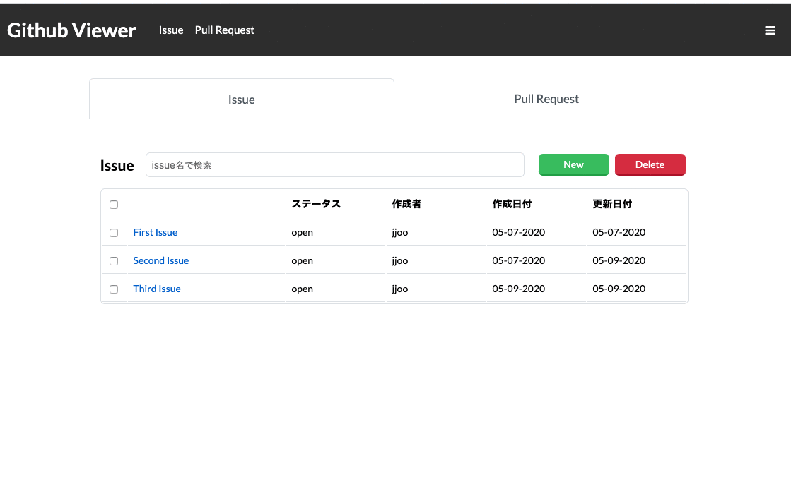

# Redux Saga Github Viewer

## 概要

こちらのリポジトリ は、[こちら](https://github.com/version-1/redux-github-viewer)のリポジトリ の続きの課題です。 
ソースをコピーして、すでに作成したソースを元に課題を進めてください。

こちら課題では実際に[Github REST API](https://docs.github.com/ja/rest/overview/resources-in-the-rest-api/)を使用して、自身のリポジトリ のissueのCRUDを行えるようにしていきます。

## デモ

こちらをAccess Tokenの関係でGithubPagesではなく[Netlify](https://www.netlify.com/)にデプロイして公開しています。
実装の際の参考にしてください。

[デモ](https://heuristic-liskov-7bdca3.netlify.app/)

## 課題で身に着けること

- Reduxでの状態管理
- React Routerでのページ設定とページ遷移
- Eslint + Prettier
- HTTPリクエスト/レスポンスの仕組み
- AjaxでのHTTPリクエストの実装
- Redux Sagaを使用した非同期通信
- Promise, Async, Await
- イテレータとジェネレータ
- Hooks API

## 課題の進め方

### 0. 課題用リポジトリの作成

フォークでなく個人のアカウントにリポジトリ を作成してください。
redux-github-viewerのソースを元にリポジトリを作成ください

#### ブランチの運用について

最後のコードレビューはプルリクエストベースでレビューを行うのでmasterブランチから
developブランチを切って課題を進めて頂くようお願いします。

最終的に完成したところでプルリクエストを作成してレビュー依頼をお願いします。

### 1. 実装に必要な概念を学ぶ

#### 引き続きRedux
- [Redux.js公式](https://redux.js.org/introduction/getting-started)
- [Redux入門【ダイジェスト版】10分で理解するReduxの基礎](https://qiita.com/kitagawamac/items/49a1f03445b19cf407b7)]
- [Redux 入門 〜Reduxの基礎を理解する〜](https://qiita.com/soarflat/items/bd319695d156654bbe86)

#### REST APIについて
- [HTTPリクエスト/レスポンスの構成要素を初心者にも分かるように解説してみた](https://qiita.com/koheiyamaguchi0203/items/5777c4653a01ae4c7b06)
- [初心者目線でAjaxの説明](https://qiita.com/hisamura333/items/e3ea6ae549eb09b7efb9)
- [RESTful APIとは何なのか](https://qiita.com/NagaokaKenichi/items/0647c30ef596cedf4bf2)
- [0からREST APIについて調べてみた](https://qiita.com/masato44gm/items/dffb8281536ad321fb08)

#### 環境変数とNode.jsのprocess.env

- [環境設定を行う！Node.jsのenvの使い方【初心者向け】](https://techacademy.jp/magazine/16243)
- [環境変数ってなに? ( Linux )](https://qiita.com/angel_p_57/items/480e3fd4552e52199835)
- [create-react-appで独自の環境変数を読み込む](https://qiita.com/zgmf_mbfp03/items/008436c5749d65f96e55)

#### HTTPクライアントのAxios
- [Axios公式](https://github.com/axios/axios)
- [axiosライブラリを使ってリクエストする](https://qiita.com/reflet/items/d5658d5d69e8e1ccd489)
- [axios、async/awaitを使ったHTTPリクエスト(Web APIを実行)](https://qiita.com/shisama/items/61cdcc09dc69fd8d3127)

### JavaScriptのアドバンスな機能

#### Promise async, wait

- [Promiseの使い方、それに代わるasync/awaitの使い方](https://qiita.com/suin/items/97041d3e0691c12f4974)

#### イテレータとジェネレータ

- [JavaScript の イテレータ を極める！](https://qiita.com/kura07/items/cf168a7ea20e8c2554c6)
- [イテレーターとジェネレーター](https://developer.mozilla.org/ja/docs/Web/JavaScript/Guide/Iterators_and_Generators)

#### ReduxでのAPI通信 Redux Saga
- [Redux Saga公式](https://redux-saga.js.org/)
- [redux-sagaをざっくり入門したい](https://hogehuga.com/post-1932/)
- [redux-sagaで非同期処理と戦う](https://qiita.com/kuy/items/716affc808ebb3e1e8ac)

### 2.デモをみながらGithubViewerを実装

- Pull Reqeustページは仮置きしているのでデモのようにタイトルだけ書いたページを置いておいてください。

- 一箇所で長時間はまってしまった場合は別の機能を実装するか質問するようお願いします。

#### チェックリスト

- [ ] リポジトリの作成(redux-github-viewerからソースをコピー)
- [ ] yarnでのパッケージインストール
  - [ ] react-notifyのインストール
  - [ ] redux-sagaのインストール
  - [ ] axiosのインストール
- [ ] issueページの実装
  - [ ] issue一覧の取得
  - [ ] issueの作成
  - [ ] issueの更新
  - [ ] issueの削除（削除するAPIはないのでissueをクローズする）
  - [ ] リクエスト成功時のトーストの表示
  - [ ] リクエスト失敗時のトーストの表示
  - [ ] レスポンシブ
- [ ] プロフィールページの実装
  - [ ] ユーザ情報のAPI経由での取得
  - [ ] フォロー数等々ユーザ情報の表示
  - [ ] レスポンシブ

### 3.netlifyでデモを公開

下記記事を参考にNetlifyでアプリを公開してください。

[React+Netlifyで最小のアプリを作る](https://crieit.net/posts/React-Netlify)

package.jsonにhomepageのキーが設定されているとうまくいかないので注意してください。

### 注意事項 

#### トースト（Notification)について

react-notifyというライブラリをつかってサイト内のトーストは実行しています。
作成・更新成功時と失敗時でそれぞれトーストを出して通知するようにしてください。

失敗時の挙動はdeveloperツールを使って一時的にネットワークをオフラインにすることで確認することができます。

#### issueの削除について

Github APIの仕様でissueの削除はできないようです。
issueをcloseステータスに更新する形で実装してください。
